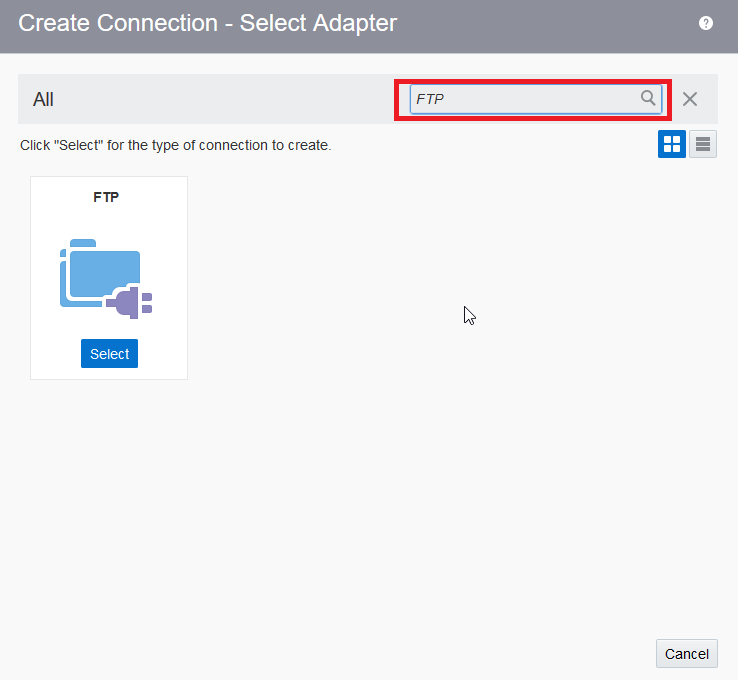
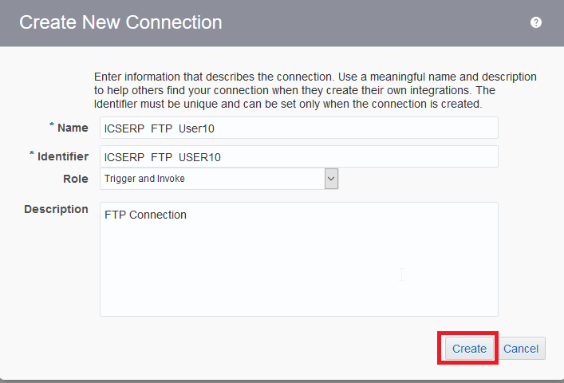
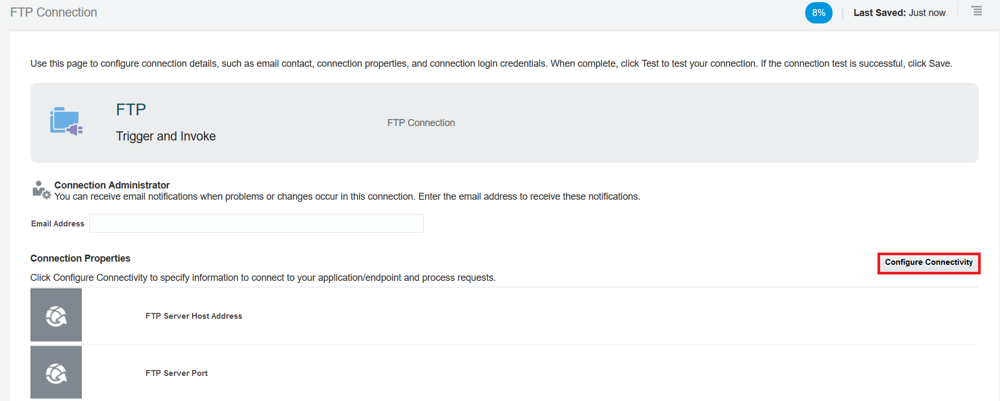
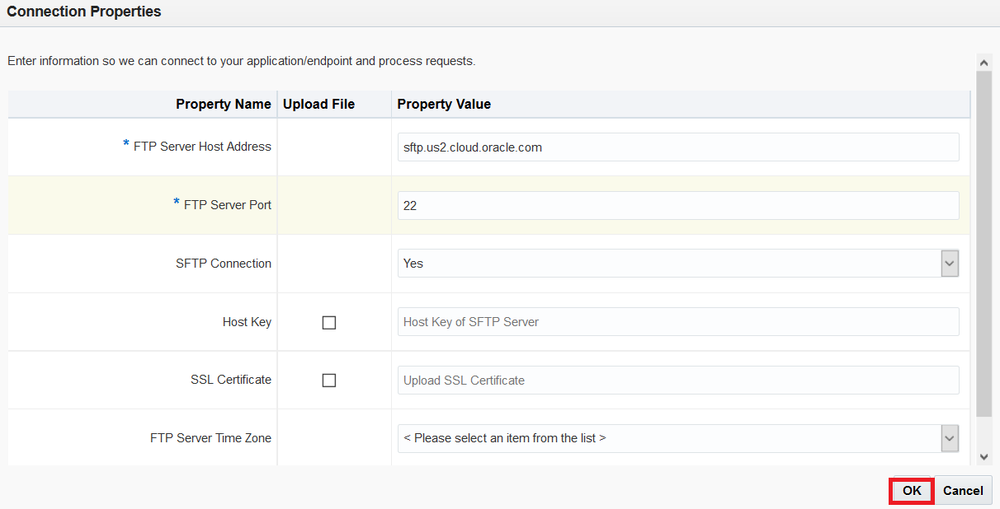
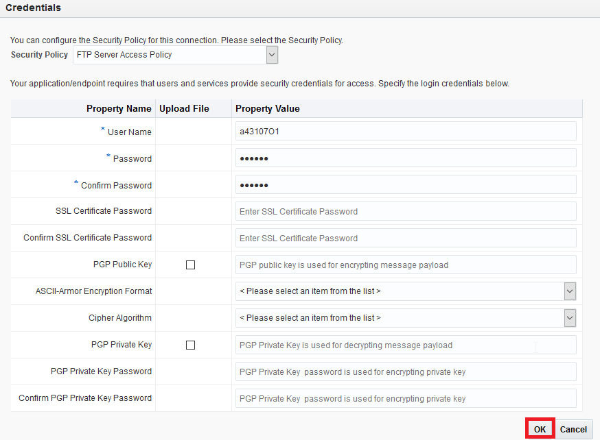
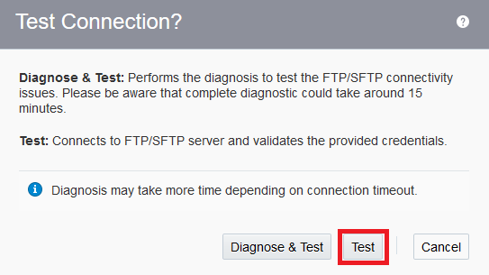
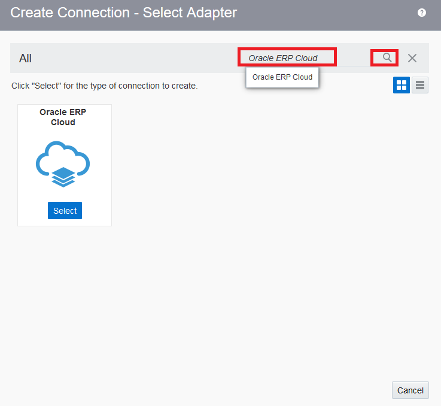
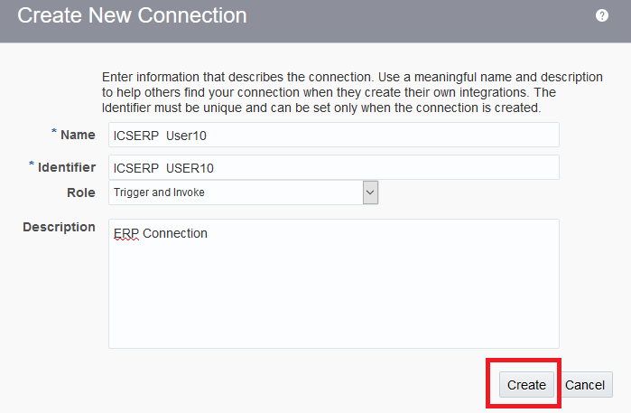
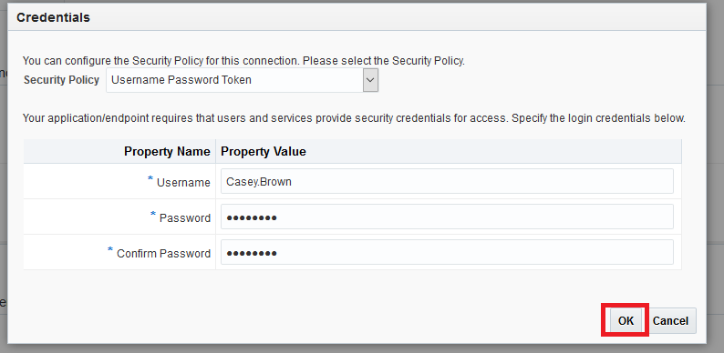

# Lab 200 - Creating ICS Connections

Updated: 03-09-18

## Introduction

This is the second of several labs that are part of the **ICS ERP Development Workshop**.

In this lab, you will learn how to create a basic ICS connection, using a basic orchestration.

**To log issues**, click here to go to the [github oracle](https://github.com/oracle/learning-library/issues/new) repository issue submission form.

## Objectives

- Create your first FTP and ERP connections to later be used in the Integration that will be created in Lab 300.

## Required Artifacts

- The following lab and an Oracle Public Cloud account that will be supplied by your instructor.

### **STEP 1** FTP Connection

- Login to your Oracle Cloud account

**NOTE:** **User Name** and **Password** values will be given to you by your instructor. See _Lab 100 - Login to your Oracle Cloud Account_ for more information on how to sign into the ICS home page. Once you login to ICS home page, click on 'Integration' on left hand side menu bar and once the integration page loads click on 'Connections' on the left hand side menu. This will load the connections page where we shall work on creating connections for the integraton.

	
	

## Creating connections

### Create FTP Connection

- This connection is used to call sFTP server and schedule the loading of files into ICS.

- Click on **Create** in the upper right of the screen

	

- Select the **FTP** Connection, by either doing a search, or by scrolling down to the **FTP** connection, by clicking on the **Select** button of the **FTP** connection.

	

- Fill in the information for the new connection and click **Create**

- **Name** in the form of _ICSERP_FTP_UserXX_ where XX is the number in your allocated user.
- **Role** _Trigger and Invoke_ since we going to use the connection as an trigger the start of an integration.

	

- Click on the connection you just created. It opens up the window for you to configure different properties for the adapter.

	

- Click on **Configure Connectivity** under **Connection Properties** section.

- There are 3 files we need to fill up.

- Enter the **FTP Server Host Address** field with the host address.

- Enter the **FTP Server Port** field with the port number.

- Make the **SFTP Connection** Yes.

- Then click **Ok** to close.

	

- Scroll down the same page and then click on the **Configure Security** under the **Security** section. This will bring up the prompt to configure your FTP Security.

- Security policy would be **FTP Server Access Policy**.

- Enter the **User Name** and **Password** provided.

- Click on **ok**.

	

- Scroll up and Click on **Test**. This opens up a popup window. Click on **Test** again.

	
	

- Click **Save**

	

- Click on the **Close** link in the upper right

- Your connection appears in the list of configured connections and is even marked as **New** !

	

### **STEP 2**: Create the ERP Connection

- This connection is used to call the ERP Cloud.

- Click on the **Connection** section

	

- Click on **Create** in the upper right of the screen

	

- Select the **Oracle ERP Cloud** Connection, by either doing a search, or by scrolling down to the **Oracle ERP Cloud** connection, by clicking on the **Select** button of the **Oracle ERP Cloud** connection.

	

- Fill in the information for the new connection and click on **create**

- **Name** in the form of _ICSERP_UserXX_ where XX is the number in your allocated user.
- **Role** _Invoke_ since we going to use the connection as an invoke to start the integration

	

- Click on **Configure Connectivity**.

	

- In the **WSDL URL** field enter the WSDL url for your ERP connection.

- The service catalog wsdl is https://<ERP Host Name>/fndAppCoreServices/ServiceCatalogService?wsdl. The serviceCatalog WSDL is a catalog of all services exposed by the ERP. The catalog exposes services from all the module such as finance, project management, order management, inventory management and so on.

**NOTE:** ERP host name can be found when you login to ERP instance. A sample ERP Url looks like -> https://ucf5-fap0742-fa-ext.oracledemos.com/fndAppCoreServices/ServiceCatalogService?wsdl

- You need to find out only (ucf5-fap0742-fa-ext.oracledemos.com) by logging into ERP instance.

- Once you enter the WSDL url, Then click **Ok** to close.

	

***NOTE*** The default security configuration is set to **Username Password Token**. When invoking the trigger, we will use our ERP Cloud username/password.

- Scroll down the same page and then click on the **Configure Security**. This will bring up the prompt to configure your ERP Cloud Security.

- You will now be asked to create the Security credentials for your ERP connection.

- Leave the **Security Policy** as **Username Password Token**.

- We need configure **User Name** and **Password**. The **User Name** and **Password** can be obtained from the supplement guide provided by the instructor.

- Now click on **Ok** to close the prompt.

	

- Click on **Test**

	

- Click **Save**

	

- Click on the **Close** link in the upper right

- Your connection appears in the list of configured connections and is even marked as **New** !

	

- This Lab is now completed.