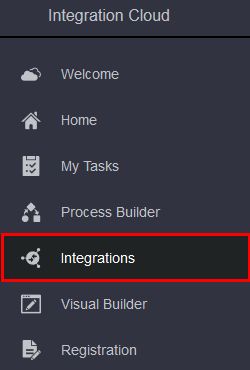
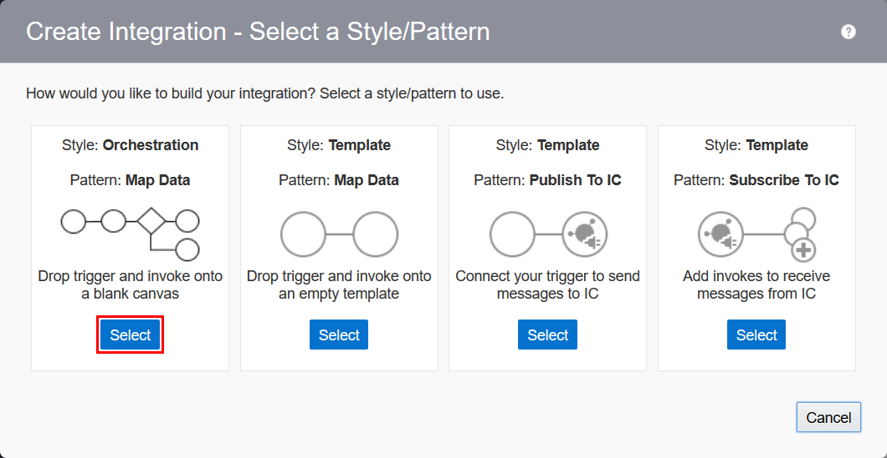
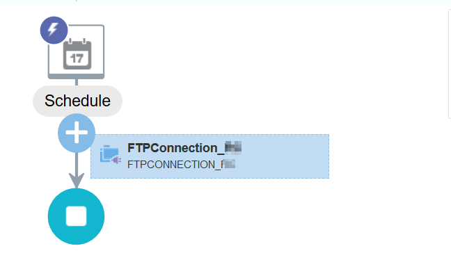

# CSH Campaign Assets 2018: File Transfer with Oracle Integration Cloud

Updated: 11-Mar-2018

## Introduction

This is the third of several labs that are part of the **CSH Campaign Assets 2018: File Transfer with Oracle Integration Cloud**. This workshop will demonstrate how to read an opaque file from a *inbound* directory and write the file to an *upload* directory in a scheduled orchestrated integration. 

In this lab, you will learn how to create a basic File Transfer integration, using a scheduled orchestration. This integration will use the FTP connection creation in the previous lab (200).

***To log issues***, click here to go to the [github oracle](https://github.com/oracle/learning-library/issues/new) repository issue submission form.

## Objectives

- Create your first integration to transfer a file from an inbound to an outbound folder.

## Required Artifacts

-   The following lab and an Oracle Public Cloud account that will be supplied by your instructor.

# Create a New Integration
Connections allow Integration Cloud to interact with an application instance. A connection is required for every application instance that participates in an integration. In this lab, you will create one connection - for an FTP folder using the FTP adapter. 

## Create the Integration

### **STEP 1**:  Create a scheduled orchestrated integration

- Start **Integration Cloud** and click on **Integrations**.

        

- In the resulting **Designer** navigation pane, click **Integrations** (default selection).

        

- In the **Integrations** pane, click on the **Create** button in the upper right.

        

- In the **Create Integration - Select a Style/Pattern** popup, select the **Orchestration**

        

- Fill in the **Create New Integration** form with the following information:

  - **What triggers this integration?**: `Schedule`	

  - **What do you want to call your integration?**: `FileTransfer_XX` (where `XX` should be your initials)

  - **Identifier**: Auto generated (keep default value)

  - **What does this integration do?**: `This is a File Transfer integration to read an opaque file from an inbound directory and write the file to an upload directory.`

  - Click **Create** to initialize and open the integration.

     

- In the **Invokes** panel, expand the **FTP** heading, and find your connection, under **FTPConnection_XX**

     

- Drag and drop your connection **FTPConnection_XX** in to the circle with plus sign. You will see the plus sign twirling when ready to drop.

     

- Fill in the required values on the **Basic Info** page.

  - **What do you want to call your endpoint**: ``
  - Click **Next**.

## Configure the FTP Connection (ReadFile & WriteFile)

## Create a Logging Message

## Configure an Assign action

## Map the data

## Track Fields

## Activate the Integration

