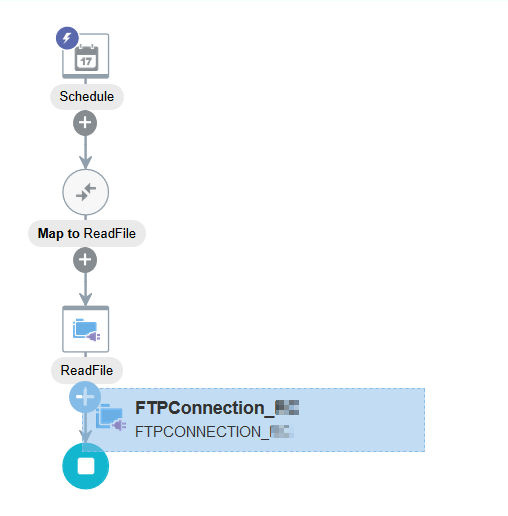
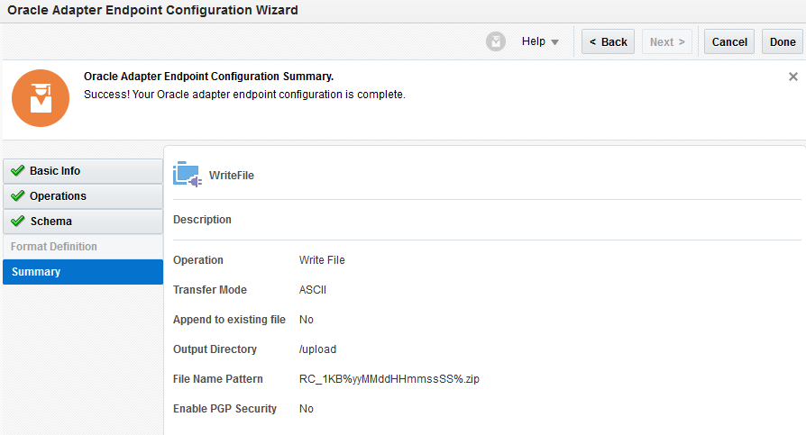
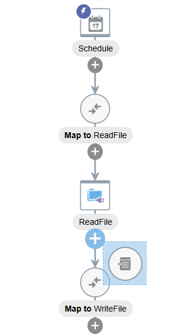

# CSH Campaign Assets 2018: File Transfer with Oracle Integration Cloud

Updated: 11-Mar-2018

## Introduction

This is the third of several labs that are part of the **CSH Campaign Assets 2018: File Transfer with Oracle Integration Cloud**. This workshop will demonstrate how to read an opaque file from a *inbound* directory and write the file to an *upload* directory in a scheduled orchestrated integration. 

In this lab, you will learn how to create a basic File Transfer integration, using a scheduled orchestration. This integration will use the FTP connection creation in the previous lab (200).

***To log issues***, click here to go to the [github oracle](https://github.com/oracle/learning-library/issues/new) repository issue submission form.

## Objectives

- Create your first integration to transfer a file from an inbound to an outbound folder.

## Required Artifacts

-   The following lab and an Oracle Public Cloud account that will be supplied by your instructor.

# Create a New Integration
Connections allow Integration Cloud to interact with an application instance. A connection is required for every application instance that participates in an integration. In this lab, you will create one connection - for an FTP folder using the FTP adapter. 

## Create the Integration

### **STEP 1**:  Create a scheduled orchestrated integration

- Start **Integration Cloud** and click on **Integrations**.

        

- In the resulting **Designer** navigation pane, click **Integrations** (default selection).

        

- In the **Integrations** pane, click on the **Create** button in the upper right.

        

- In the **Create Integration - Select a Style/Pattern** popup, select the **Orchestration**

        

- Fill in the **Create New Integration** form with the following information:

  **What triggers this integration?**: `Schedule`	

  **What do you want to call your integration?**: `FileTransfer_XX` (where `XX` should be your initials)

  **Identifier**: Auto generated (keep default value)

  **What does this integration do?**: `This is a File Transfer integration to read an opaque file from an inbound directory and write the file to an upload directory.`

  Click **Create** to initialize and open the integration.

     

## Configure the FTP Connections (ReadFile & WriteFile)

Let's start with the **FTP Adapter** for the **Read File** operation. We will configure a read file in binary mode from an inbound directory of the server specified in the **Connections** page. No schema is defined for this file transfer, so it is treated as an attachment.

- In the **Invokes** panel, expand the **FTP** heading, and find your connection, under **FTPConnection_XX**

     

- Drag and drop your connection **FTPConnection_XX** in to the circle with the plus sign. You will see the plus sign twirling when ready to drop.

     

- In the **Basic Info** page, enter `ReadFile` for endpoint name and click **Next**.
  
- In the **Operations** page, enter the following information and click **Next**.
  
  - **Select Operation**: `Read a File`
  
  - **Select a Transfer Mode**: `Binary`

  - **Input Directory**: `/`

  - **File Name**: `1KB.zip`

- In the **Schema** page, enter the following information and click **Next**.

  **Do you want to define a schema for this endpoint?**: `No`
  
- Validate your values in the **Summary Page**.

     
  
- Click **Done**.

- Click **Save** on the main canvas to save your work.

Let's continue with the **FTP Adapter** for the **Write File** operation. We will configure a write file to the outbound directory on the same server specified in the **Connections** page, that matches the file name pattern of `XX_1KB%yyMMddHHmmssSS%.zip`.

- In the **Invokes** panel, expand the **FTP** heading, and find your connection, under **FTPConnection_XX**

     

- Drag and drop your connection **FTPConnection_XX** below the **ReadFile** connection in to the circle with the plus sign. You will see the plus sign twirling when ready to drop.

     

- In the **Basic Info** page, enter `WriteFile` for endpoint name and click **Next**.

- In the **Operations** page, enter the following information and click **Next**.
  
  -  **Select Operation**: `Write File`
  
  - **Select a Transfer Mode**: `ASCII`

  - **Output Directory**: `/upload`

  - **File Name Pattern**: `XX_1KB%yyMMddHHmmssSS%.zip` (where `XX` should be your initials)

  - **Enable PGP Security**: `No`

  - **Do you want to define a schema for this endpoint?**: `No`
  
- Validate your values in the **Summary Page**.

     

- Click **Done**.

- Click **Save** on the main canvas to save your work.

Observe that the orchestration's design palette is populated with the Connections **ReadFile** and **WriteFile** just created along with their mapping.

## Create Logging Messages
A logging message is created to indicate that the file name has been read. Another logging message is created to indicate the file name has been uploaded to the `/upload` directory Both messages are logged to the activity stream.

Let's start with the first **Logger** action to indicate a file read has occurred.

- In the **Action** panel,  drag and drop the **Logger** action after the **ReadFile** connection in to the circle with the plus sign. You will see the plus sign twirling when ready to drop.

     

- In the **Create Action** wizard, enter `LogReadFileName` for Name and click **Create**.
 
- In the **Logger Action** page, select `Always` under Log and click on the **Expression Builder** (pencil icon)

     

Well will create a new expression that will show the file name in the logger.  

- Go to the **Components** pane, and search for the **concat** function. Enter `concat`and click **Enter**.

     

- Drag and drop the **concat** function in to the **Expression** text area.

     

- Replace the **string1** of the expression with the static value (including quotes) `"Filename is: "`. 

- We will copy the file name variable as the second string parameter. Select the **string2** text in the expression, and press **Delete**. Leave the cursor where the second parameter should be entered.

     

- In the **Source** pane, expand $ReadFile > $SynchReadFileResponse > FileReadResponse > [Load More] > FTPResponseHeader. Make sure the cursor is in the position of the second parameter. Select the **fileName** element and click on the right arrow icon  to copy it as parameter in the **concat** function.  

     

- Click on **Validate**, then **Close** in the upper right to exit the  **Log Message** expression builder canvas.

     

- Click on **Validate**, then **Close** in the upper right to exit the **Logger Action** canvas.

     

- Save the progress of your orchestration by clicking on the **Save** icon in the upper right of the design window.

Let's continue with the next **Logger** action to log the write file info. 

- In the **Action** panel,  drag and drop the **Logger** action after the **WrriteFile** connection in to the circle with the plus sign. You will see the plus sign twirling when ready to drop.

 image

- In the **Create Action** wizard, enter `LogWriteFileInfo` for Name and click **Create**.

## Configure an Assign action

## Map the data

## Track Fields

## Activate the Integration

