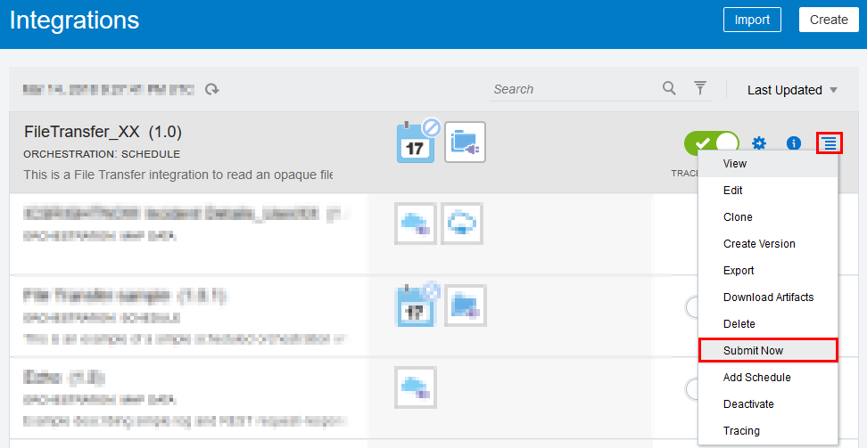
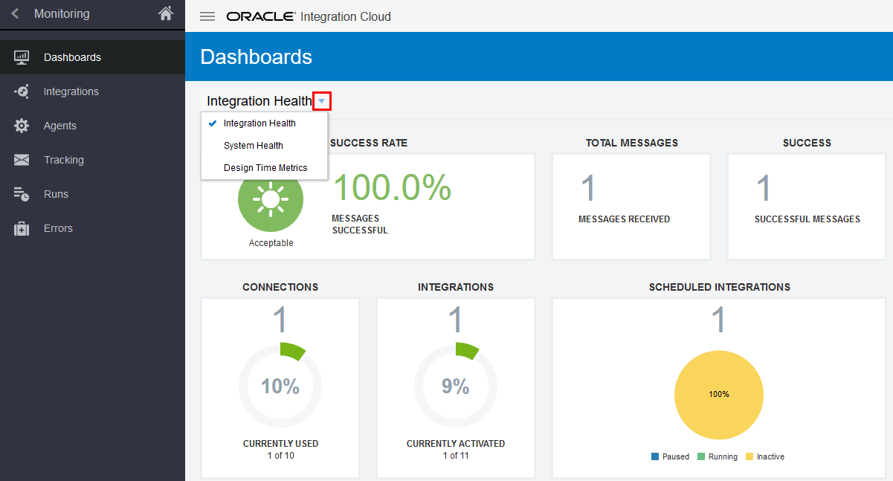
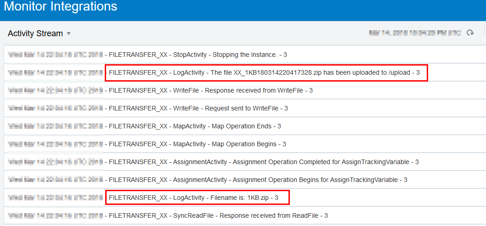

# Lab 400 - Testing the Integration

Updated: 13-Mar-2018

## Introduction

This is the fourth several labs that are part of the **CSH Campaign Assets 2018: File Transfer with Oracle Integration Cloud**. This workshop will demonstrate how to read an opaque file from a *inbound* directory and write the file to an *upload* directory in a scheduled orchestrated integration. 

In this lab, you will learn how to test a basic File Transfer integration using a scheduled orchestration. 

**To log issues**, click here to go to the [github oracle](https://github.com/oracle/learning-library/issues/new) repository issue submission form.

## Objectives

- Test the integration built in Lab 300.

## Required Artifacts

- The following lab and an Oracle Public Cloud account that will be supplied by your instructor.

# Test the File Transfer Integration

The final step to determine if your integration is working properly is to run the integration process which will copy a file from an inbound FTP folder and copy it to an outbound FTP folder. 

## Run the Integration

### **STEP 1** Submit Run

- From the Actions menu of your integration, select the **Action** menu  and click on **Submit Now**.

  

View the following message at the top of the page. You are ready to monitor the results of the file transfer.

*The **id** of your run will be different than shown here. It will reflect the actual ID number of your test instance, which you will match when you monitor the results.* 

## Monitor the results

### **STEP 2** Open Activity Streams

-   In the navigation pane, click  icon next to **Designer**.
    
-   Click **Monitoring**, then click **Dashboards**.

By default, the **Dashboard** page displays overall system status, including the percentage of successful messages, total number of messages, total number of successful messages, and total number of failed messages. Details about currently used connections, currently activated integrations, and scheduled integrations are also provided. You can also view the activity stream and download diagnostic logs and incident reports. From the 
**Integration Health** dropdown menu, you can additionally view overall system health and design time metrics.

- Next, click **Activity Stream** in the dashboard pane to view details about the scheduled integration. 

  

  The log indicates the 1 KB file was uploaded to the `/upload` directory.

  

- In the **Monitoring** navigation pane, click **Tracking** and note that the **FileTransfer_XX** integration instance is listed as completed. You can see the filename and file size, which enables you to look for particular files in case of problems.

  

- In the **Monitoring** navigation pane, click **Integrations** and note that the message was successfully received and processed without any errors. For this example, **Schedule is not defined** is displayed because this scheduled integration was invoked with the **Submit Now** option.

  

Congratulations! You have now completed the final lab of the **File Transfer with Oracle Integration Cloud** Workshop.  
